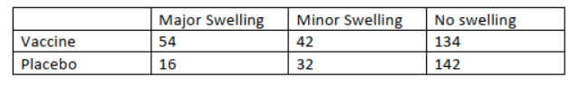

```{r setup, include=FALSE}
library(tidyverse)
library(readxl)
library(patchwork)
library(multcomp)
knitr::opts_chunk$set(
  fig.height = 6,
  fig.width = 8,
  message = F,
  echo = F,
  warning = F
)
theme_set(theme_minimal() + theme(legend.position = "bottom"))
options(
  ggplot2.continuous.colour = "viridis",
  ggplot2.continuous.fill = "viridis",
  digits = 3
)
scale_colour_discrete = scale_colour_viridis_d
scale_fill_discrete = scale_fill_viridis_d

```

# Problem 1
In the context of ANOVA model, prove the partitioning of the total variability (sum of squares),
i.e.,
$$ \sum_i\sum_j(y_{ij} - \overline{\bar{y}})^2 = \sum_i\sum_j(y_{ij}-\bar{y_i})^2 + (\bar{y_i} - \overline{\bar{y}})^2$$

__PROOF__
we have by definition, the
$$ y_{ij} - \overline{\bar{y}} = (y_{ij}-\bar{y_i}) + (\bar{y_i} - \overline{\bar{y}})$$

Fixing within group i, we have within group variance:
$$\begin{aligned}
 \sum_j(y_{ij} - \overline{\bar{y}})^2\\
 =\sum_j[ (y_{ij}-\bar{y_i}) + (\bar{y_i} - \overline{\bar{y}})]^2\\
 = \sum_j{ (y_{ij}-\bar{y_i})^2 + (\bar{y_i} - \overline{\bar{y}})^2
 +  2*(y_{ij}-\bar{y_i})(\bar{y_i} - \overline{\bar{y}})}\\
\end{aligned}$$

With $\sum_j y_{ij}/n_j = \bar{y_i}$ and $\sum_j 1= n_j$
$$\begin{aligned}
\sum_j{2*(y_{ij}-\bar{y_i})(\bar{y_i} - \overline{\bar{y}})}\\
= 2\sum_j y_{ij}*\bar{y_i} - y_{ij}*\overline{\bar{y}} - 
\bar{y_i}^2 + \bar{y_i}*\overline{\bar{y}}\\
=2*n_j*\bar{y_i}^2 - 2*n_j*\bar{y_i}*\overline{\bar{y}} - 
2*n_j*\bar{y_i}^2 + 2*n_j*\bar{y_i}*\overline{\bar{y}}\\
rearrange = 2*n_j*\bar{y_i}^2 - 2*n_j*\bar{y_i}^2 
+ 2*n_j*\bar{y_i}*\overline{\bar{y}}-2*n_j*\bar{y_i}*\overline{\bar{y}}\\
= 0
\end{aligned}$$

Now sum over group i we have
$$ \sum_i\sum_j(y_{ij} - \overline{\bar{y}})^2 = \sum_i\sum_j(y_{ij}-\bar{y_i})^2 + (\bar{y_i} - \overline{\bar{y}})^2$$


\newpage
# Problem 2
A rehabilitation center is interested in examining the relationship between physical status before
therapy (‘below average’, ‘average’ and ‘above average’) and the time (days) required in physical
therapy until successful rehabilitation. Records from patients 18-30 years old were collected and
provided to you for statistical analysis (dataset “Knee.csv”).

Assuming that data are normally distributed, answer the questions below:

a) Generate descriptive statistics for each group and comment on the differences observed. (4p)

b) Using a type I error of 0.01, obtain the ANOVA table. State the hypotheses, test statistic,
critical value, and decision interpreted in the context of the problem. (5p)

c) Based on your response in part b), perform pairwise comparisons with the appropriate
adjustments (Bonferroni, Tukey, and Dunnett – ‘below average’ as reference). Report your
findings and comment on the differences/similarities between these three methods. (5p)

d) Write a short paragraph summarizing your overall results as if you were presenting to the
rehabilitation center director. (1p)

__PROOF__

## a)

```{r}
knee_data =
  read_csv(here::here("file/Knee.csv")) %>%
  pivot_longer(cols = Below:Above,
               names_to = "status",
               values_to = "day_to_rehab") %>%
  janitor::clean_names() %>%
  mutate(status =
           forcats::fct_relevel(status, "Below", "Average", "Above"))

skimr::skim_without_charts(knee_data %>% group_by(status))

knee_data %>%
  ggplot(aes(x = status, y = day_to_rehab, fill  = status)) +
  geom_boxplot()
```

## b)
$H_0$ : there's no difference between groups

$H_1$ : at least one group is different from the other groups

$Between~Sum~of~Square = \sum_{i=1}^k\sum_{j=1}^{n_i}(\bar{y_i} - \bar{\bar{y}})^2=\sum_i^kn_i\bar{y_i}^2-\frac{y_{..}^2}{n}$

$Within~Sum~of~Square = \sum_{i=1}^k\sum_{j=1}^{n_i}(y_{ij}-\bar{y_i})^2=\sum_i^k(n_i-1)s_i^2$

$Between~Mean~Square = \frac{\sum_{i=1}^k\sum_{j=1}^{n_i}(\bar{y_i} - \bar{\bar{y}})^2}{k-1}$

$Within~Mean~Square = \frac{\sum_{i=1}^k\sum_{j=1}^{n_i}(y_{ij}-\bar{y_i})^2}{n-k}$

$F_{statistics} = \frac{Between~Mean~Square}{Within~Mean~Square} \sim F(k-1,n-k)$

$Reject ~ H_0 ~ if ~ F>F_{k-1,n-k,1-\alpha}$

$Fail ~ reject ~ H_0 ~ if ~F<F_{k-1,n-k,1-\alpha}$

```{r}
knee_anova =
  aov(day_to_rehab ~ status, data = knee_data, alpha = 0.01)

summary(knee_anova)

qf(0.99, 2, 22)
```
\ At 99% confidence level, the F-statistics is greater than the critical value(`r qf(0.99, 2, 22)`), we reject the null hypothesis that there's no difference between groups.

## c)
```{r}
bon =
  pairwise.t.test(
    x = knee_data$day_to_rehab,
    g = knee_data$status,
    p.adjust.method = "bonferroni"
  )
show(bon)

Tukey =
  TukeyHSD(knee_anova)
show(Tukey)
plot(Tukey)

summary(glht(knee_anova), linfct = mcp(Group = "Dunnett"))
```

# Problem 3
A research article was published with the following headline “For adults, chicken pox vaccine may
stop shingles”. The findings were based on a randomized clinical trial with a total of 420 adults
being randomized to receive either chicken pox vaccine or placebo. While the results were
intriguing, some side effects emerged and required further investigation. The table below
summarizes the frequencies of one of the most frequent and concerning side effect - swelling
around the injection site.


Use a significance level of 0.05 to assess if the distribution of swelling status is the same for the
two treatment populations.

a) Justify the appropriate test to be used for addressing the question of interest. (2p)

b) Provide the table with all values necessary for calculating the test statistic. (4p)

c) State the hypotheses, test statistic, critical value, p value and decision rule interpreted in the
context of the problem. (4p)

__PROOF__

## a)

\ we are examining the associatation between Vaccine status and Swelling symptom. And there're more than 2 groups, so Contigency table with Chi-sq test for independent would be the testing method we consider.

## b)
```{r}
Prob3_table =
  matrix(c(54,16,42,32,134,142),ncol = 3,
         dimnames = list(
           c("Vaccine","Placebo"),
           c("Major_Swelling",
             "Minor_Swelling",
             "No_Swelling")
         ))
## Observed Value
Prob3_table %>% as.tibble() %>% knitr::kable(caption = "Observed Values")

Prob3 =
  chisq.test(Prob3_table)

## Expected Value
Prob3$expected %>% as.tibble() %>% knitr::kable(caption = "Expected Values")
```
\ All expected values in the cells are greater than 5, the normality for Chi-sq test is fitted. We continue applying Chi-sq test.

## c)

$H_0$ : the swelling symptom is independent of vaccine status

$H_1$ : the swelling symptom is dependent/associate of vaccine status

$\mathcal{X}^2 = \sum_i^{row}\sum_j^{col}\frac{(n_{ij}-E_{ij})^2}{E_{ij}} \sim \mathcal{X}^2_{df = (row-1)\times(col-1)}$
  
$Reject ~ H_0 ~ if ~ \mathcal{X}^2>\mathcal{X}^2_{(r-1))*(c-1),1-\alpha}$

$Fail ~ reject ~ H_0 ~ if ~\mathcal{X}^2<\mathcal{X}^2_{(r-1))*(c-1),1-\alpha}$

```{r}
Prob3 
```

\ The Chi-sq statistics value is greater than the critical value at 95% confidence level, so we reject the null hypothesis that the the swelling symptom is independent to vaccine status.
